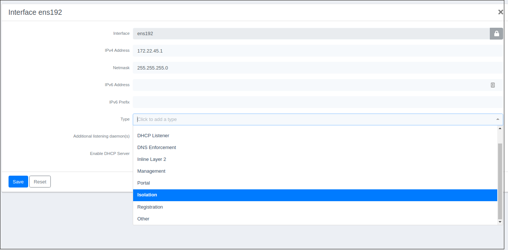

# Opensource NAC Research

---

## Index

- [Contributors](#contributors)
- [Project Scope](#project-scope)
- [Abstract](#abstract)
- [Studied Technology and Headlines](#studied-technology-and-headlines)
  - [Packetfence](#packetfence)
    - [802.1X Support](#8021x-support)
    - [Registration of Devices](#registration-of-devices)
    - [Wireless Integration](#wireless-integration)
    - [Detection of Abnormal Network Activities](#detection-of-abnormal-network-activities)
    - [Windows Management Instrumentation (WMI)](#windows-management-instrumentation-wmi)
    - [Proactive Vulnerability Scans](#proactive-vulnerability-scans)
    - [Security Agents](#security-agents)
    - [Remediation Through a Captive Portal](#remediation-through-a-captive-portal)
  - [OpenVAS/GVM](#openvasgvm)
- [Tests and Conclusions](#tests-and-conclusions)
- [General Evaluation]
- [Appendix](#appendix)
- [References](#references)

---

## CONTRIBUTORS

| Name - Surname    |
| :---------------- |
| ARDA ÖZKAL        |
| FATIH MALAKÇI     |
| RUKİYE GÜL ÖZTÜRK |
| SERHAT ERDENER    |

---

## PROJECT SCOPE

This is a research of open source NAC solutions that can be used instead of
commercial counterparts by physically constructing a similar big scale
infrastructure environment. Also testing the chosen open source NAC solution in
this environment.

---

## ABSTRACT

The purpose of this project is establishing an infrastructure that uses an open
source NAC software. Our wish from this system is to scan user devices who wants
to join our network. A "guest zone" should be created for guest users after the
scan and users should be assigned to VLAN's according to their roles/levels.

After the research & development process done by our team we decided to use a
open source project that's actively supported by a community. That's why
`Packetfence` NAC tool is chosen because it allows `OpenVAS/GVM`,
`Windows Management Instrumentation` (_WMI_) complience check for different
operating systems and can be integrated via 802.1x authentication &
authorisation.

After the tests it has been seen that Compliance Check feature is not working as
intended and Packetfence cannot integrate well with the compliance check
softwares available us to use. That's why we decided to conclude the research,
the tests performed and their results have been detailed inside this document.

---

## Studied Technology and Headlines

The softwares which will be used for open source NAC solution are detailed
below.

### Packetfence

`PacketFence` is a fully supported, trusted, Free and Open Source network access
control (NAC) solution. Boasting an impressive feature set including a
captive-portal for registration and remediation, centralized wired and wireless
management, 802.1X support, layer-2 isolation of problematic devices,
integration with the `Snort` IDS and the `Nessus` vulnerability scanner;
`PacketFence` can be used to effectively secure networks - from small to very
large heterogeneous networks.


#### 802.1X Support

Wireless and wired 802.1X is supported through a `FreeRADIUS` module which is
included in `PacketFence`. PEAP-TLS, EAP-PEAP and many more EAP mechanisms can
be used.

#### Registration of Devices

`PacketFence` supports an optional registration mechanism similar to "captive
portal" solutions. Contrary to most captive portal solutions, `PacketFence`
remembers users who previously registered and will automatically give them
access without another authentication. Of course, this is configurable. An
Acceptable Use Policy can be specified such that users cannot enable network
access without first accepting it.

#### Wireless Integration

`PacketFence` integrates perfectly with wireless networks through a `FreeRADIUS`
module. This allows you to secure your wired and wireless networks the same way
using the same user database and using the same captive portal, providing a
consistent user experience. Mixing access points (AP) vendors and wireless
controllers is supported.

#### Detection of Abnormal Network Activities

Abnormal network activities (computer virus, worms, spyware, traffic denied by
establishment policy, etc.) can be detected using local and remote `Snort`,
`Suricata` or commercial sensors. Content inspection is also possible with
`Suricata`, and can be combined with malware hash databases such as
`OPSWAT Metadefender`. Beyond simple detection, `PacketFence` layers its own
alerting and suppression mechanism on each alert type. A set of configurable
actions for each violation is available to administrators.

#### Windows Management Instrumentation (WMI)

`WMI` support in `PacketFence` allows an administrator to perform audits,
execute commands and even more on any domain-joined Windows computers. For
example, `PacketFence` can verify if some unauthorized software are installed
and/or running before granting network access.

#### Proactive Vulnerability Scans

`Nessus` or `OpenVAS` vulnerability scans can be performed upon registration,
scheduled or on an ad-hoc basis. `PacketFence` correlates the `Nessus`/`OpenVAS`
vulnerability ID's of each scan to the violation configuration, returning
content specific web pages about which vulnerability the host may have.

#### Security Agents

`PacketFence` integrates with security agent solutions such as
`OPSWAT Metadefender Endpoint Management`, `Symantec SEPM` and others.
`PacketFence` can make sure the agent is always installed before granting
network access. It can also check the endpoint's posture and isolate it from any
other endpoints if non-compliant.

#### Remediation Through a Captive Portal

Once trapped, all network traffic is terminated by the `PacketFence` system.
Based on the nodes current status (unregistered, open violation, etc), the user
is redirected to the appropriate URL. In the case of a violation, the user will
be presented with instructions for the particular situation he/she is in,
reducing costly help desk intervention.

#### Isolation of Problematic Devices

`PacketFence` supports several isolation techniques, including VLAN isolation
with VoIP support (even in heterogeneous environments) for multiple switch
vendors [1].

### OpenVAS/GVM

`OpenVAS` is a full-featured vulnerability scanner. Its capabilities include
unauthenticated testing, authenticated testing, various high level and low level
Internet and industrial protocols, performance tuning for large-scale scans and
a powerful internal programming language to implement any type of vulnerability
test.

The scanner is developed and maintained by Greenbone Networks since 2009. The
works are contributed as Open Source to the community under the GNU General
Public License (GNU GPL) [2].

---

## Tests and Conclusions

`Packetfence` supports 4 different Compliance Check software, The free/open
source ones are marked below.

- `OpenVAS/GVM` - _free/open source_
- `WMI` (Windows Management Instrumentation) - _free of charge_
- `Rapid7`
- `Nessus` (and `Nessus 6`)

We will study `openVAS/GVM` and `WMI` because others are commercial products
which we will not cover in this study.

## OpenVAS/GVM

`OpenVAS/GVM` is a full-featured vulnerability scanner that's been developed by
Greenbone Networks GmbH.

After 2017 `OpenVAS` name is changed to `GVM` as part of the version 10 update.

---

## Appendix

[Install Guide](#install-guide)

---

## References

[1] https://www.packetfence.org/ \
[2] https://www.openvas.org/ \
[3] https://packages.debian.org/buster/openvas \
[4] https://community.greenbone.net/t/shutting-down-gcf-http-download/5339 \
[5] https://community.greenbone.net/t/gvm-20-08-stable-initial-release-2020-08-12/6312 \
[6] https://github.com/inverse-inc/packetfence/issues/5791 \
[7] https://docs.greenbone.net/API/GMP/gmp-20.08.html#changes \
[8] https://github.com/inverse-inc/packetfence/pull/6082 \
[9] https://github.com/inverse-inc/packetfence/issues/5877

---

## Install Guide

The document contains detailed information on the installations of the software
to be used for the Open Source NAC solution.

- [1. PacketFence](#1-packetfence-setup)
  - [1.1 System Requirements](#11-system-requirements)
  - [1.2 Installation](#12-installation)
  - [1.3 Setting and Configuring](#13-setting-and-configuring)
- [2. GVM-20](#2-gvm-20)
  - [2.1 Installation](#21-installation)

---

### 1. PacketFence Setup

PacketFence is a fully supported, trusted, Free and Open Source network access
control (NAC) system.

#### 1.1 System Requirements

PacketFence reuses many components in an infrastructure. Nonetheless, it will
install the following ones and manage them itself:

```
database server (MariaDB)
web server (Apache)
DHCP server (PacketFence)
RADIUS server (FreeRADIUS)
firewall (iptables)
```

The following provides a list of the minimum server hardware recommendations:

```
Intel or AMD CPU 3 GHz, 2 CPU cores
12 GB of RAM (16 GB recommended)
100 GB of disk space (RAID-1 recommended)
1 network card (2 recommended)
```

**For installation, a machine with Centos 7 operating system is used in a
physical server environment.**

#### 1.2 Installation

Start the installation by updating the system.

As the `root`: <ins>Unless otherwise stated, perform operations as root user.
!!</ins>

```bash
# yum update
```

PacketFence will not work properly if SELinux or AppArmor are enabled. You will
need to explicitly disable SELinux from the `/etc/selinux/config` file and
reboot the machine.

```
Disable firewall
Disable SELinux
```

Continue by installing the kernel development package.

```bash
# yum install kernel-devel-$(uname -r)
```

Add the repo for the PacketFence installation process.

```bash
# yum localinstall http://packetfence.org/downloads/PacketFence/RHEL7/packetfence-release-7.stable.noarch.rpm
```

Once the repository is defined, you can install PacketFence with all its
dependencies, and the required external services (database server, DHCP server,
RADIUS server) using:

```bash
# yum install --enablerepo=packetfence packetfence
```

#### 1.3 Setting and Configuring

#### Interface Configuration

First of all, we adjust the network interfaces in our device. To do this,
configure the network interfaces under `/etc/sysconfig/network-scripts` on the
Centos 7 machine. To view it, you can view the interfaces in the **Configuration
-> Network Configuration -> Interfaces** section of the PacketFence web
interface.


To determine the type of interfaces, select the interface you will configure
from the list. You can edit it from the `Type` section.



You can also edit from `/usr/local/pf/conf/networks.conf` file. The example
shows the necessary settings for "isolation network".

```
[172.22.45.0]
dns=172.22.45.1
gateway=172.22.45.1
domain-name=vlan-isolation.
pool_backend=memory
named=enabled
dhcp_end=172.22.45.246
netmask=255.255.255.0
split_network=disabled
netflow_accounting_enabled=disabled
dhcp_start=172.22.45.10
nat_enabled=disabled
dhcp_max_lease_time=30
fake_mac_enabled=disabled
dhcpd=enabled
type=vlan-isolation
dhcp_default_lease_time=30
coa=disabled
id=172.22.45.0
```

#### Adding a Switch

To add a Switch, select a group by clicking the `New Switch` button from **Web
UI -> Policies and Access Control -> Switches** menu. Below is an example of
adding the Aruba 2930M switch.


- Roles Tab : This tab specifies which roles will be assigned to which VLAN
  groups.


- CLI Tab : In this tab, username/password information is entered in order to
  make CLI connection to the switch.


- RADIUS Tab : In this tab, a password must be entered for RADIUS.


You can also edit from the `/usr/local/pf/conf/switches.conf` file. The
configuration used in the tests is arranged as follows.

```
[default]
type=Aruba::2930M
cliAccess=Y
# Command Line Interface·
# cliTransport could be: Telnet, SSH or Serial
cliTransport=SSH
cliUser=admin
cliPwd=tei11252
always_trigger=1

[172.22.41.253]
description=Aruba
registrationVlan=46
defaultVlan=45
isolationVlan=45
radiusSecret=tei1234
RoleMap=Y
registrationUrl=http://172.22.20.22/Aruba::2930M
coaPort=3799
UrlMap=Y
isolationRole=45
registrationRole=44
SNMPCommunityWrite=teitest1
group=default
SNMPVersion=2c
SNMPVersionTrap=2c
level3Vlan=44
level1Vlan=42
level2Vlan=43
SNMPCommunityRead=teitest1
VoIPEnabled=Y
SNMPCommunityTrap=teitest1
useCoA=N
cliPwd=tei112552
cliEnablePwd=tei112552
```

#### Adding Domains to Active Directory

To connect PacketFence to the domain, make the necessary arrangements by
clicking the `New Domain` button from the **Configuration -> Policies and Access
Control -> Active Directory Domains** menu.


You can also edit from `/usr/local/pf/conf/domain.conf` file. The configuration
used in the tests is arranged as follows.

```
[teilab]
status=enabled
ntlm_cache_filter=(&(samAccountName=*)(!(|(lockoutTime=>0)(userAccountControl:1.2.840.113556.1.4.803:=2))))
registration=0
ntlm_cache_expiry=3600
dns_name=tei.lab
dns_servers=172.22.20.20
ou=Computers
ntlm_cache_on_connection=disabled
workgroup=TEI
ntlm_cache_batch_one_at_a_time=disabled
ad_server=172.22.20.20
sticky_dc=*
ntlm_cache_batch=disabled
server_name=%h
ntlmv2_only=0
```

#### Adding to Authentication Source

"Authentication Source" must be added to determine the criteria by which users
will log in. We base our tests on AD criteria.

Select the "Active Directory" criteria by clicking the `New Internal Source`
button in the **Configuration -> Policies and Access Control -> Authentication
Sources** section in the web interface.

The AD Authentication Source settings used in the tests are arranged as follows.

[authentication01](images/auth1.png)

[authentication02](images/auth2.png)

[authentication03](images/auth3.png)


