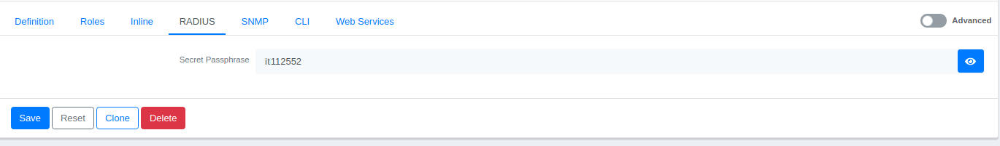
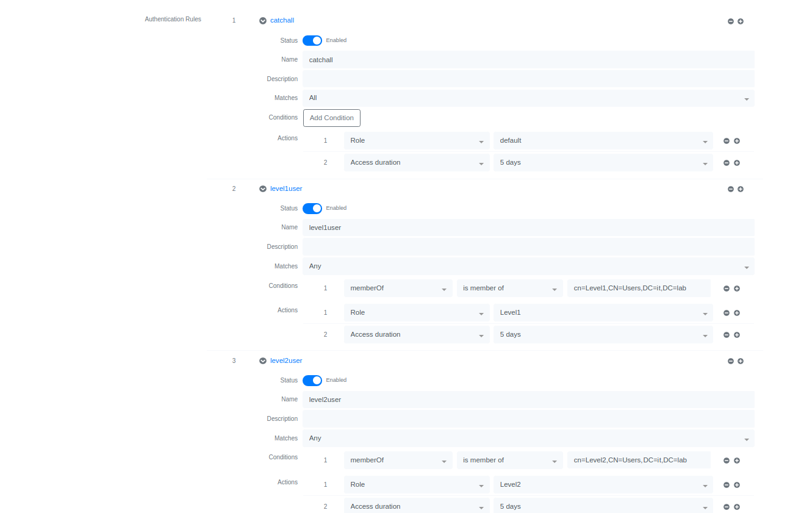

## Install Guide

The document contains detailed information on the installations of the software
to be used for the Open Source NAC solution.

- [1. PacketFence](#1-packetfence)
  - [1.1 System Requirements](#11-system-requirements)
  - [1.2 Installation](#12-installation)
  - [1.3 Setting and Configuring](#13-setting-and-configuring)
- [2. GVM-20](#2-gvm-20)
  - [2.1 Installation](#21-installation)

---

### 1. PacketFence

PacketFence is a fully supported, trusted, Free and Open Source network access
control (NAC) system.

#### 1.1 System Requirements

PacketFence reuses many components in an infrastructure. Nonetheless, it will
install the following ones and manage them itself:

```
database server (MariaDB)
web server (Apache)
DHCP server (PacketFence)
RADIUS server (FreeRADIUS)
firewall (iptables)
```

The following provides a list of the minimum server hardware recommendations:

```
Intel or AMD CPU 3 GHz, 2 CPU cores
12 GB of RAM (16 GB recommended)
100 GB of disk space (RAID-1 recommended)
1 network card (2 recommended)
```

**For installation, a machine with Centos 7 operating system is used in a
physical server environment.**

#### 1.2 Installation

Start the installation by updating the system.

As the `root`: <ins>Unless otherwise stated, perform operations as root user.
!!</ins>

```bash
# yum update
```

PacketFence will not work properly if SELinux or AppArmor are enabled. You will
need to explicitly disable SELinux from the `/etc/selinux/config` file and
reboot the machine.

```
Disable firewall
Disable SELinux
```

Continue by installing the kernel development package.

```bash
# yum install kernel-devel-$(uname -r)
```

Add the repo for the PacketFence installation process.

```bash
# yum localinstall http://packetfence.org/downloads/PacketFence/RHEL7/packetfence-release-7.stable.noarch.rpm
```

Once the repository is defined, you can install PacketFence with all its
dependencies, and the required external services (database server, DHCP server,
RADIUS server) using:

```bash
# yum install --enablerepo=packetfence packetfence
```

#### 1.3 Setting and Configuring

#### Interface Configuration

First of all, we adjust the network interfaces in our device. To do this,
configure the network interfaces under `/etc/sysconfig/network-scripts` on the
Centos 7 machine. To view it, you can view the interfaces in the **Configuration
-> Network Configuration -> Interfaces** section of the PacketFence web
interface.


To determine the type of interfaces, select the interface you will configure
from the list. You can edit it from the `Type` section.


You can also edit from `/usr/local/pf/conf/networks.conf` file. The example
shows the necessary settings for "isolation network".

```
[172.22.45.0]
dns=172.22.45.1
gateway=172.22.45.1
domain-name=vlan-isolation.
pool_backend=memory
named=enabled
dhcp_end=172.22.45.246
netmask=255.255.255.0
split_network=disabled
netflow_accounting_enabled=disabled
dhcp_start=172.22.45.10
nat_enabled=disabled
dhcp_max_lease_time=30
fake_mac_enabled=disabled
dhcpd=enabled
type=vlan-isolation
dhcp_default_lease_time=30
coa=disabled
id=172.22.45.0
```

#### Adding a Switch

To add a Switch, select a group by clicking the `New Switch` button from **Web
UI -> Policies and Access Control -> Switches** menu. Below is an example of
adding the Aruba 2930M switch.


- Roles Tab : This tab specifies which roles will be assigned to which VLAN
  groups.


- CLI Tab : In this tab, username/password information is entered in order to
  make CLI connection to the switch.


- RADIUS Tab : In this tab, a password must be entered for RADIUS.



You can also edit from the `/usr/local/pf/conf/switches.conf` file. The
configuration used in the tests is arranged as follows.

```
[default]
type=Aruba::2930M
cliAccess=Y
# Command Line Interface·
# cliTransport could be: Telnet, SSH or Serial
cliTransport=SSH
cliUser=admin
cliPwd=it11252
always_trigger=1

[172.22.41.253]
description=Aruba
registrationVlan=46
defaultVlan=45
isolationVlan=45
radiusSecret=it1234
RoleMap=Y
registrationUrl=http://172.22.20.22/Aruba::2930M
coaPort=3799
UrlMap=Y
isolationRole=45
registrationRole=44
SNMPCommunityWrite=ittest1
group=default
SNMPVersion=2c
SNMPVersionTrap=2c
level3Vlan=44
level1Vlan=42
level2Vlan=43
SNMPCommunityRead=ittest1
VoIPEnabled=Y
SNMPCommunityTrap=ittest1
useCoA=N
cliPwd=it112552
cliEnablePwd=it112552
```

#### Adding Domains to Active Directory

To connect PacketFence to the domain, make the necessary arrangements by
clicking the `New Domain` button from the **Configuration -> Policies and Access
Control -> Active Directory Domains** menu.


You can also edit from `/usr/local/pf/conf/domain.conf` file. The configuration
used in the tests is arranged as follows.

```
[itlab]
status=enabled
ntlm_cache_filter=(&(samAccountName=*)(!(|(lockoutTime=>0)(userAccountControl:1.2.840.113556.1.4.803:=2))))
registration=0
ntlm_cache_expiry=3600
dns_name=it.lab
dns_servers=172.22.20.20
ou=Computers
ntlm_cache_on_connection=disabled
workgroup=it
ntlm_cache_batch_one_at_a_time=disabled
ad_server=172.22.20.20
sticky_dc=*
ntlm_cache_batch=disabled
server_name=%h
ntlmv2_only=0
```

#### Adding a Authentication Source

"Authentication Source" must be added to determine the criteria by which users
will log in. We base our tests on AD criteria.

Select the "Active Directory" criteria by clicking the `New Internal Source`
button in the **Configuration -> Policies and Access Control -> Authentication
Sources** section in the web interface.

The AD Authentication Source settings used in the tests are arranged as follows.





#### Adding a Scanner

Click on the `New Scan Engine` button in the **Configuration -> Compliance ->
Scan Engines** section in the web interface and select the Scan Engine you want
to add.

The adjustments made for the OpenVAS/GVM scanning tool used in the tests are
arranged as follows.


#### Adding a Connection Profile

Click on the `New Connection Profile` button from the **Configuration ->
Policies and Access Control -> Connection Profiles** menu in the web interface.
Make the necessary adjustments.

Connection Profile settings named "registration" used in the tests are arranged
as follows.


#### Adding Realm

Click on the `Default Realm` button in the **Configuration -> Policies and
Access Control -> Realms** menu in the web interface. Make the necessary
adjustments.


You can also edit from `/usr/local/pf/conf/realm.conf` file. The configuration
used in the tests is arranged as follows.

```
[1 DEFAULT]
permit_custom_attributes=disabled
radius_auth_proxy_type=keyed-balance
radius_auth_compute_in_pf=enabled
eduroam_radius_auth=
domain=itlab
eduroam_radius_auth_proxy_type=keyed-balance
eduroam_radius_acct=
radius_acct_proxy_type=load-balance
radius_auth=
eduroam_radius_auth_compute_in_pf=enabled
eduroam_radius_acct_proxy_type=load-balance
radius_acct=
ldap_source=itlab
```

#### Adding a Roles

Click on the `New Role` button in the **Configuration -> Policies and Access
Control -> Roles** menu in the web interface and save by giving a name.


### 2. GVM-20

OpenVAS, renamed GVM, is a browser whose technology we will use for
vulnerability detection. Required setup and usage are described below.

***!!!NOTES: While proceeding with the installation, the operations will
continue by switching between the two users. To distinguish, command lines with
'$' at the beginning will be used to denote GVM user, command lines with '#' at
the beginning will be used to denote Root user.***

#### 2.1 Installation

Start the installation by installing the necessary tools and packages. As `root`
user: <ins>!! Unless otherwise stated, perform operations as root user.
</ins>

```bash
# yum update
# yum install python3
```

Set Python 3 as default.

```bash
# alternatives --config python

1 /usr/libexec/no-python
2 /usr/bin/python3
Enter to keep the current selection[+], or type selection number: 2
```

Continue by installing the EPEL repository.

```bash
# yum install epel-release
```

SElinux must be disabled before installing Redis. For this, set the value of
SELINUX to **disable** in `/etc/selinux/config` file. Restart the machine to
apply the change.

```
# sestatus

"Disable SELinux"

# sestatus
```

Activate the Centos-Powertools repository.

```bash
# yum config-manager --set-enabled PowerTools
```

Install the Centos development tools.

```bash
# yum groupinstall -y “Development Tools”
```

Install the necessary Centos packages.

```bash
# yum install -y cmake glib2-devel zlib-devel gnutls-devel libuuid-devel libssh-devel
# yum ınstall -y libxml2-devel libgcrypt-devel openldap-devel popt-devel redis libical-devel
# yum install -y openssl-devel hiredis-devel radcli-devel gpgme-devel libksba-devel doxygen
# yum install -y libpcap-devel nodejs python3-polib libmicrohttpd-devel gnutls-utils python3-devel
# yum install -y libpq-devel texinfo xmltoman nmap sshpass socat mingw32-gcc ncurses-devel
```

Install the Postgres database server.

```bash
# yum install -y postgresql-server postgresql-contrib postgresql-server-devel
```

Configure the Postgres databases.

```bash
# sudo -Hiu postgres
# createuser gvm
# createdb -O gvm gvmd
# psql gvmd
# create role dba with superuser noinherit
# grant dba to gvm
# create extension if not exists "uuid-ossp"
# create extension cryptogram
# exit
# systemctl restart postgresql
```

Add GVM libraries to the system.

```bash
# echo "/opt/gvm/lib" > /etc/ld.so.conf.d/gvm.conf
# ldconfig
```

Add the GVM user and create the directory structure.

```bash
# useradd -r -d /opt/gvm -s /bin/bash gvm
# mkdir /opt/gvm
# mkdir /opt/gvm/src
# chown -R gvm:gvm /opt/gvm
```

Continue by adding the GVM extension to the **/etc/profile** file. Add the lines
`pathmunge /opt/gvm/sbin after` and `pathmunge /opt/gvm/bin after` using the
command below. *Make sure that the `unset` command is placed above it.*

```bash
# sed -i "/^done/a \pathmunge /opt/gvm/sbin after" /etc/profile
# sed -i "/^done/a \pathmunge /opt/gvm/bin after" /etc/profile
```

Install the GVM-20 packages. As the `GVM` user:

```bash
$ cd /opt/gvm/src
$ wget -O gvm-libs-20.8.0.tar.gz https://github.com/greenbone/gvm-libs/archive/v20.8.0.tar.gz
$ wget -O openvas-20.8.0.tar.gz https://github.com/greenbone/openvas/archive/v20.8.0.tar.gz
$ wget -O ospd-20.8.1.tar.gz https://github.com/greenbone/ospd/archive/v20.8.1.tar.gz
$ wget -O ospd-openvas-20.8.1.tar.gz https://github.com/greenbone/ospd-openvas/archive/v20.8.0.tar.gz
$ wget -O gvmd-20.8.1.tar.gz https://github.com/greenbone/gvmd/archive/v20.8.0.tar.gz
$ wget -O gsa-20.8.1.tar.gz https://github.com/greenbone/gsa/archive/v20.8.0.tar.gz
$ wget -O openvas-smb-1.0.5.tar.gz https://github.com/greenbone/openvas-smb/archive/v1.0.5.tar.gz
```

Open the source files. As the `GVM` user:

```bash
$ cd /opt/gvm/src
$ find . -name '*.gz' -exec tar xvfz {} \;
```

Configure each package with **make**.

- for `gvm-libs`: As the `GVM` user

```bash
$ cd /opt/gvm/src
$ export PKG_CONFIG_PATH=/opt/gvm/lib/pkgconfig
$ cd gvm-libs-20.8.0
$ mkdir build
$ cd build
$ cmake .. -DCMAKE_INSTALL_PREFIX=/opt/gvm
$ make
$ make doc
$ make install
```

- for `heimdal` : As the `root` user

```bash
# cd /usr/local/src
# wget
# https://github.com/heimdal/heimdal/releases/download/heimdal-7.7.0/heimdal-7.7.0.tar.gz
# tar xvfz heimdal-7.7.0.tar.gz
# cd heimdal-7.7.0
# ./configure --enable-otp=no --prefix=/opt/heimdal
# make
# make install
# ln -s /opt/heimdal/include /opt/heimdal/include/heimdal
# echo "/opt/heimdal/lib" > /etc/ld.so.conf.d/heimdal.conf
# ldconfig
```

- for `scanner` : As the `GVM` user

```bash
$ cd /opt/gvm/src
$ export PKG_CONFIG_PATH=/opt/gvm/lib/pkgconfig
$ cd openvas-20.8.0
$ mkdir build
$ cd build
$ cmake .. -DCMAKE_INSTALL_PREFIX=/opt/gvm
$ make
$ make doc
$ make install
```

Install Redis using the distributed config file. As the `root` user

```bash
# cp /etc/redis.conf /etc/redis.conf.orig
# cp /opt/gvm/src/openvas-20.8.0/config/redis-openvas.conf /etc/redis.conf
# chown redis /etc/redis.conf
```

Change the `/etc/redis.conf` location to `/tmp/redis.sock`.

```
# unixsocket /tmp/redis.sock
# unixsocketperm 770
```

Configure Openvas under Centos to suit the way redis works. As the `GVM` user :

```bash
$ echo "db_address = /tmp/redis.sock" > /opt/gvm/etc/openvas/openvas.conf
```

Perform the next operations while you are the `root` user.

```bash
# systemctl enable redis
# systemctl start redis
```

Create the "disable-thp" service.

```
# cat << EOF > /etc/systemd/system/disable-thp.service
[Unit]
Description=Disable Transparent Huge Pages (THP)

[Service]
Type=simple
ExecStart=/bin/sh -c “echo ‘never’ >
/sys/kernel/mm/transparent_hugepage/enabled && echo ‘never’ > /sys/kernel/mm/transparent_hugepage/defrag”

[Install]
WantedBy=multi-user.target
EOF
```

Enable the service.

```bash
# systemctl daemon-reload
# systemctl start disable-thp
# systemctl enable disable-thp
```

Add the `GVM` user in redis group and reboot the redis.

```bash
# usermod -aG redis gvm
# systemctl restart redis
```

In the next step, enter the information in the "/etc/sudoers" file with
`visudo`.

```
# #Allow the user running ospd-openvas, to launch openvas with root permissions
# gvm ALL = NOPASSWD: /opt/gvm/sbin/openvas
# gvm ALL = NOPASSWD: /opt/gvm/sbin/gsad
```

Continue by making a few more adjustments to the system.

```bash
# echo "net.core.somaxconn = 1024" >> /etc/sysctl.conf
# echo "vm.overcommit_memory = 1" >> /etc/sysctl.conf
# sysctl -p
# ldconfig
```

Synchronize the NVT data. This may take a while, wait until it has finished
syncing the NVTs. Perform transactions when `GVM` is a user :

```
$ greenbone-nvt-sync
```

Run the query to provide the checks. You should see a value of more than 60,000
as the number of files.

```
$ find /opt/gvm/var/lib/openvas/plugins | wc -l
```

Update the VT information.

```
$ openvas --update-vt-info
```

Continue the process by configuring **GVMD**. Perform operations when you are a
`root` user.

```
# ln -s /usr/include /usr/include/postgresql
```

In the next step, as the `GVM` user :

```bash
$ cd /opt/gvm/src
$ export PKG_CONFIG_PATH=/opt/gvm/lib/pkgconfig
$ cd gvmd-20.8.1
$ mkdir build
$ cd build
$ cmake .. -DCMAKE_INSTALL_PREFIX=/opt/gvm
$ make
$ make doc
$ make install
```

To create a **GSA**, install the prerequisite `yarn`. As the `root` user :

```bash
# npm install -g yarn
```

Configure the **GSA**. As the `GVM` user :

```bash
$ cd /opt/gvm/src
$ export PKG_CONFIG_PATH=/opt/gvm/lib/pkgconfig
$ cd gsa-20.8.1
$ mkdir build
$ cd build
$ cmake .. -DCMAKE_INSTALL_PREFIX=/opt/gvm
$ make
$ make doc
$ make install

$ greenbone-scapdata-sync
$ greenbone-certdata-sync
$ gvm-manage-certs -a
```

Create and install `OSPd` and `OSPd-OpenVAS`. OSPd and OSPd-OpenVAS are actually
python packages. You must create the Python packages directory. Perform the
operation while the `GVM` user.

```bash
$ python3 --version
$ mkdir -p /opt/gvm/lib/python3.x/site-packages
```

As the `root` user. Install the package according to your python version.

```bash
# yum install python3x-devel
```

As the `GVM` user :

```bash
$ cd /opt/gvm/src
$ export PYTHONPATH=/opt/gvm/lib/python3.x/site-packages
$ export PKG_CONFIG_PATH=/opt/gvm/lib/pkgconfig
$ cd ospd-20.8.1
$ python3 setup.py install --prefix=/opt/gvm

$ cd /opt/gvm/src
$ export PYTHONPATH=/opt/gvm/lib/python3.x/site-packages
$ export PKG_CONFIG_PATH=/opt/gvm/lib/pkgconfig
$ cd ospd-openvas-20.8.1
$ python3 setup.py install --prefix=/opt/gvm
```

Add scripts of services. As the `root` user.

- Content to be created for the `OSPd`:

```bash
# cat << EOF > /etc/systemd/system/ospd.service
[Unit]
Description=Job that runs the ospd-openvas daemon
Documentation=man:gvm
After=postgresql.service

[Service]
Environment=PATH=/opt/gvm/bin/ospd-scanner/bin:/opt/gvm/bin:/opt/gvm/sbin:/opt/gvm/.local/bin:/usr/local/sbin:/usr/local/bin:/usr/sbin:/usr/bin:/sbin:/bin
Environment=PYTHONPATH=/opt/gvm/lib/python3.6/site-packages
Type=simple
User=gvm
Group=gvm
WorkingDirectory=/opt/gvm
PIDFile=/opt/gvm/var/run/ospd-openvas.pid
ExecStart=/usr/bin/python3 /opt/gvm/bin/ospd-openvas --pid-file \
         /opt/gvm/var/run/ospd-openvas.pid --unix-socket /opt/gvm/var/run/ospd.sock \
         --log-file /opt/gvm/var/log/gvm/ospd-openvas.log --lock-file-dir \
         /opt/gvm/var/run

[Install]
WantedBy=multi-user.target
EOF
```

- Content to be created for the `GVMD`:

```bash
# cat << EOF > /etc/systemd/system/gvmd.service
[Unit]
Description=Job that runs the gvm daemon
Documentation=man:gvm
After=ospd.service

[Service]
Type=forking
User=gvm
Group=gvm
PIDFile=/opt/gvm/var/run/gvmd.pid
WorkingDirectory=/opt/gvm
ExecStartPre=/bin/sleep 60
ExecStart=/opt/gvm/sbin/gvmd --listen=0.0.0.0 --port=9390
--osp-vt-update=/opt/gvm/var/run/ospd.sock

[Install]
WantedBy=multi-user.target
EOF
```

- Content to be created for the `GSAD`:

```bash
# cat << EOF > /etc/systemd/system/gsad.service
[Unit]
Description=Job that runs the gsa daemon
Documentation=man:gsa
After=postgresql.service

[Service]
Type=forking
PIDFile=/opt/gvm/var/run/gsad.pid
WorkingDirectory=/opt/gvm
ExecStart=/opt/gvm/sbin/gsad --listen=0.0.0.0 --mlisten=127.0.0.1 --mport=9390
[Install]
WantedBy=multi-user.target
EOF
```

Install the packages for the PDF reports to work. As `root` user :

```bash
# yum -y install texlive-collection-fontsrecommended
# texlive-collection-latexrecommended texlive-changepage texlive-titlesec
# mkdir -p /usr/share/texlive/texmf-local/tex/latex/comment
# cd /usr/share/texlive/texmf-local/tex/latex/comment
# wget http://mirrors.ctan.org/macros/latex/contrib/comment/comment.sty 10
# chmod 644 comment.sty
# texhash
```

Add cronjob. You can change the schedule as per your wish. As the `GVM` user :

```
$ crontab -e

0 21 * * * /opt/gvm/bin/greenbone-nvt-sync
0 22 * * * /opt/gvm/sbin/greenbone-certdata-sync
0 23 * * * /opt/gvm/sbin/greenbone-scapdata-sync
```

Enable the services. As the `root` user :

```bash
# systemctl daemon-reload
# systemctl enable ospd
# systemctl enable gvmd
# systemctl enable gsad
# systemctl start ospd
# systemctl start gvmd
# systemctl start gsad
```

Replace the default browser with the new socket location. As the `GVM` user.

Have the OpenVAS browser ID.

```
$ gvmd --get-scanners
```

Change the browser location.

```
$ gvmd --modify-scanner=<scanner_id> --scanner-host=/opt/gvm/var/run/ospd.sock
```

Verify the browser.

```
$ gvmd --verify-scanner=<scanner_id>
```

If the browser is running, you should see such a printout. *Scanner version:
OpenVAS 7.0.1.*

Create an administrator user for the user interface. As the `GVM` user :

```bash
$ gvmd --create-user admin
$ gvmd --user=admin --new-password=<password>
```

Connect to the interface : **https://your-machine-ip**

If you do not see any scan configurations in the **Configuration-> Scan Config**
menu in the web UI, some settings need to be changed to access configurations
and ports.

Get the administrator user ID with this command. Perform transactions while
`GVM` user.

```bash
$ gvmd --get-users --verbose
$ gvmd --modify-setting 78eceaec-3385-11ea-b237-28d24461215b --value <admin_id>
$ greenbone-feed-sync --type GVMD_DATA
```
